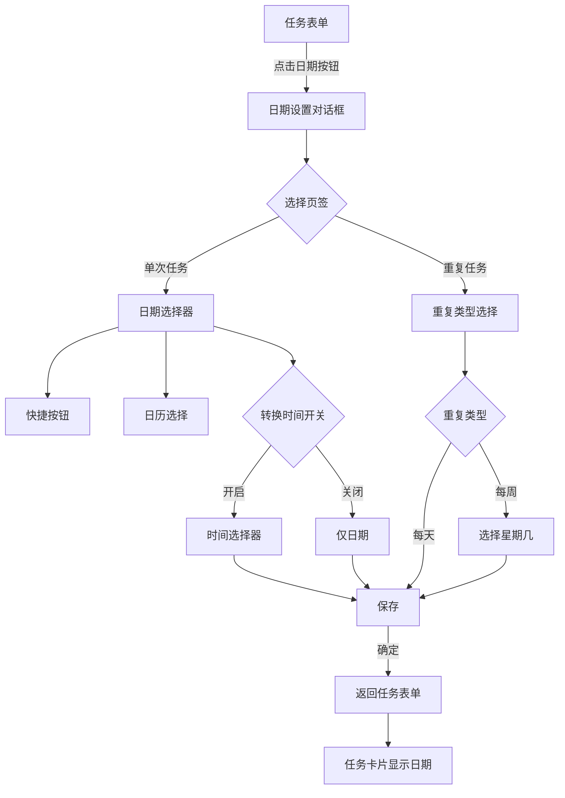

# 任务日期和重复功能设计文档

## 1. 需求概述

### 1.1 功能目标
为任务管理系统添加日期和重复功能，支持以下场景：
- 单次任务：设置开始日期（可精确到时间）
- 重复任务：每天或每周重复（每周可指定星期几）
- 快捷设置：今天、明天、下周一
- 时间精度：可选择是否包含具体时间

### 1.2 核心需求
1. ✅ 可以设置日期、日期 + 精确时间、重复任务
2. ✅ 任务表单上添加按钮唤起日期设置表单
3. ✅ 重复任务和单一时间互斥（通过页签区分）
4. ✅ 精确时间开关（打开后可选择时间，关闭仅精确到天）
5. ✅ 快捷添加：今天、明天、下周一
6. ✅ 重复任务：每天和每周，每周可选择具体星期几
7. ✅ 任务卡片上显示日期，重复任务显示循环图标
8. ✅ UI 参考提供的设计图

---

## 2. 数据模型设计

### 2.1 数据库字段（Prisma Schema）

在 `Task` 模型中添加以下字段：

```prisma
model Task {
  // ... 现有字段
  
  // 日期相关字段
  startDate   DateTime? @map("start_date")      // 开始日期（可选）
  includeTime Boolean   @default(false) @map("include_time") // 是否包含具体时间
  
  // 重复任务相关字段
  repeatType  String?   @db.VarChar(20) @map("repeat_type")  // 重复类型: none, daily, weekly, custom
  repeatDays  String?   @db.VarChar(50) @map("repeat_days")  // 重复的星期几，JSON格式: [0,1,2,3,4,5,6]
}
```

### 2.2 TypeScript 类型定义

在 `packages/keyDoContract/src/task.ts` 中扩展接口：

```typescript
/**
 * 重复类型枚举
 */
export type RepeatType = 'none' | 'daily' | 'weekly' | 'custom';

/**
 * 任务接口
 */
export interface Task {
  id: string;
  title: string;
  description?: string;
  quadrant: QuadrantType;
  completed: boolean;
  order: string;
  
  // 日期相关字段
  startDate?: string;        // ISO 8601 格式，带时区（如：2026-02-04T14:30:00.000+08:00）
  includeTime?: boolean;     // 是否包含具体时间
  
  // 重复任务字段
  repeatType?: RepeatType;   // 重复类型
  repeatDays?: number[];     // 重复的星期几（0=周日，1=周一，...，6=周六）
  
  createdAt: string;
  updatedAt: string;
}

/**
 * 创建任务 Schema
 */
export const createTaskSchema = z.object({
  title: z.string().min(1).max(64),
  description: z.string().max(1000).optional(),
  quadrant: z.enum(['Q1', 'Q2', 'Q3', 'Q4']),
  order: z.string().optional(),
  
  // 日期字段
  startDate: z.string().datetime().optional(),  // ISO 8601 格式
  includeTime: z.boolean().optional(),
  
  // 重复任务字段
  repeatType: z.enum(['none', 'daily', 'weekly', 'custom']).optional(),
  repeatDays: z.array(z.number().min(0).max(6)).optional(),
});

/**
 * 更新任务 Schema
 */
export const updateTaskSchema = z.object({
  // ... 现有字段
  startDate: z.string().datetime().optional(),
  includeTime: z.boolean().optional(),
  repeatType: z.enum(['none', 'daily', 'weekly', 'custom']).optional(),
  repeatDays: z.array(z.number().min(0).max(6)).optional(),
});
```

### 2.3 字段说明

| 字段 | 类型 | 说明 | 示例 |
|------|------|------|------|
| `startDate` | `DateTime?` | 开始日期，可选 | `2026-02-04T14:30:00.000+08:00` |
| `includeTime` | `Boolean` | 是否包含具体时间 | `true` 表示精确到时间，`false` 仅精确到天 |
| `repeatType` | `String?` | 重复类型 | `none`（默认）、`daily`、`weekly`、`custom` |
| `repeatDays` | `String?` | 重复的星期几（JSON） | `[1,3,5]` 表示周一、周三、周五 |

### 2.4 业务规则

1. **互斥关系**：
   - `startDate` 和 `repeatType`（非 `none`）互斥
   - 有 `startDate` 时，`repeatType` 应为 `none` 或 `undefined`
   - 有 `repeatType`（非 `none`）时，`startDate` 应为 `undefined`

2. **时间精度**：
   - `includeTime` 仅在 `startDate` 存在时有效
   - `includeTime = false`：时间部分为 `00:00:00`
   - `includeTime = true`：包含具体时间

3. **重复任务**：
   - `repeatType = 'daily'`：每天重复，`repeatDays` 为空
   - `repeatType = 'weekly'`：每周固定日期重复，需要 `repeatDays`
   - `repeatType = 'custom'`：自定义星期几（保留扩展性）
   - `repeatDays` 的值：`0` = 周日，`1` = 周一，... ，`6` = 周六

---

## 3. UI/UX 设计

### 3.1 整体交互流程



### 3.2 组件层级结构

```
TaskFormDialog (任务表单)
  └── DateSettingButton (日期设置按钮)
      └── DateTimeDialog (日期时间对话框)
          ├── Tabs (页签)
          │   ├── TabsList
          │   │   ├── TabsTrigger: "单次任务"
          │   │   └── TabsTrigger: "重复任务"
          │   ├── TabsContent: "单次任务"
          │   │   ├── QuickButtons (快捷按钮)
          │   │   │   ├── Button: "今天"
          │   │   │   ├── Button: "明天"
          │   │   │   └── Button: "下周一"
          │   │   ├── Calendar (日历组件)
          │   │   └── TimeToggle (时间开关)
          │   │       ├── Switch: "转换时间"
          │   │       └── TimePicker (时间选择器)
          │   │           ├── Select: 时
          │   │           └── Select: 分
          │   └── TabsContent: "重复任务"
          │       ├── Select: 重复类型
          │       │   ├── Option: "每天"
          │       │   └── Option: "每周"
          │       └── WeekdaySelector (星期选择器)
          │           └── ToggleGroup: 一~日
          └── DialogFooter
              └── Button: "确定"

TaskCard (任务卡片)
  ├── Checkbox
  ├── Content
  │   ├── Title
  │   └── DateBadge (日期徽章)
  │       ├── Icon: Calendar / Repeat
  │       └── Text: 日期文本
  └── ContextMenu
```

### 3.3 组件设计详情

#### 3.3.1 DateTimeDialog（日期时间对话框）

**功能：**
- 通过页签切换"单次任务"和"重复任务"
- 单次任务页签：日期选择 + 时间选择
- 重复任务页签：重复类型选择 + 星期几选择

**Props：**
```typescript
interface DateTimeDialogProps {
  open: boolean;
  value: {
    startDate?: string;
    includeTime?: boolean;
    repeatType?: RepeatType;
    repeatDays?: number[];
  };
  onOpenChange: (open: boolean) => void;
  onConfirm: (value: DateTimeValue) => void;
}
```

**UI 参考：**
- 第一张图片：单次任务页签的 UI
- 第二张图片：重复任务页签的 UI

#### 3.3.2 单次任务页签

**快捷按钮区域：**
```tsx
<div className="flex gap-2 mb-4">
  <Button variant="outline" onClick={() => setToday()}>今天</Button>
  <Button variant="outline" onClick={() => setTomorrow()}>明天</Button>
  <Button variant="outline" onClick={() => setNextMonday()}>下周一</Button>
  <Button variant="outline" onClick={() => setCustom()}>特定</Button>
</div>
```

**日历组件：**
- 使用 `shadcn/ui` 的 `Calendar` 组件
- 支持单选日期
- 高亮当前选中日期

**时间开关 + 时间选择器：**
```tsx
<div className="flex items-center justify-between mt-4">
  <Label>转换时间</Label>
  <Switch checked={includeTime} onCheckedChange={setIncludeTime} />
</div>

{includeTime && (
  <div className="flex gap-2 mt-2">
    <Select value={hour} onValueChange={setHour}>
      <SelectTrigger className="w-20">
        <SelectValue placeholder="09时" />
      </SelectTrigger>
      <SelectContent>
        {Array.from({ length: 24 }, (_, i) => (
          <SelectItem key={i} value={String(i).padStart(2, '0')}>
            {String(i).padStart(2, '0')}时
          </SelectItem>
        ))}
      </SelectContent>
    </Select>
    
    <span className="flex items-center">:</span>
    
    <Select value={minute} onValueChange={setMinute}>
      <SelectTrigger className="w-20">
        <SelectValue placeholder="00分" />
      </SelectTrigger>
      <SelectContent>
        {[0, 15, 30, 45].map((m) => (
          <SelectItem key={m} value={String(m).padStart(2, '0')}>
            {String(m).padStart(2, '0')}分
          </SelectItem>
        ))}
      </SelectContent>
    </Select>
  </div>
)}
```

#### 3.3.3 重复任务页签

**重复类型选择：**
```tsx
<div className="space-y-4">
  <div>
    <Label>重复执行</Label>
    <Select value={repeatType} onValueChange={setRepeatType}>
      <SelectTrigger>
        <SelectValue placeholder="自定义" />
      </SelectTrigger>
      <SelectContent>
        <SelectItem value="daily">每天</SelectItem>
        <SelectItem value="weekly">每周</SelectItem>
      </SelectContent>
    </Select>
  </div>
  
  {repeatType === 'weekly' && (
    <div>
      <Label>选择星期</Label>
      <ToggleGroup type="multiple" value={repeatDays} onValueChange={setRepeatDays}>
        <ToggleGroupItem value="1">一</ToggleGroupItem>
        <ToggleGroupItem value="2">二</ToggleGroupItem>
        <ToggleGroupItem value="3">三</ToggleGroupItem>
        <ToggleGroupItem value="4">四</ToggleGroupItem>
        <ToggleGroupItem value="5">五</ToggleGroupItem>
        <ToggleGroupItem value="6">六</ToggleGroupItem>
        <ToggleGroupItem value="0">日</ToggleGroupItem>
      </ToggleGroup>
    </div>
  )}
</div>
```

#### 3.3.4 TaskCard 日期显示

**单次任务显示：**
```tsx
{task.startDate && (
  <Badge variant="secondary" className="ml-2 text-xs">
    <CalendarIcon className="w-3 h-3 mr-1" />
    {formatDate(task.startDate, task.includeTime)}
  </Badge>
)}
```

**重复任务显示：**
```tsx
{task.repeatType && task.repeatType !== 'none' && (
  <Badge variant="secondary" className="ml-2 text-xs">
    <RepeatIcon className="w-3 h-3 mr-1" />
    {formatRepeat(task.repeatType, task.repeatDays)}
  </Badge>
)}
```

**日期格式化函数：**
```typescript
// 单次任务日期格式化
function formatDate(dateStr: string, includeTime: boolean): string {
  const date = new Date(dateStr);
  const today = new Date();
  const tomorrow = new Date(today);
  tomorrow.setDate(today.getDate() + 1);
  
  // 判断是否是今天或明天
  if (isSameDay(date, today)) {
    return includeTime ? `今天 ${formatTime(date)}` : '今天';
  }
  if (isSameDay(date, tomorrow)) {
    return includeTime ? `明天 ${formatTime(date)}` : '明天';
  }
  
  // 其他日期
  const formatted = `${date.getMonth() + 1}月${date.getDate()}日`;
  return includeTime ? `${formatted} ${formatTime(date)}` : formatted;
}

// 重复任务格式化
function formatRepeat(repeatType: RepeatType, repeatDays?: number[]): string {
  if (repeatType === 'daily') {
    return '每天';
  }
  if (repeatType === 'weekly' && repeatDays && repeatDays.length > 0) {
    const weekdayNames = ['日', '一', '二', '三', '四', '五', '六'];
    const days = repeatDays.map(d => weekdayNames[d]).join('、');
    return `每周${days}`;
  }
  return '重复';
}

// 时间格式化
function formatTime(date: Date): string {
  const hours = String(date.getHours()).padStart(2, '0');
  const minutes = String(date.getMinutes()).padStart(2, '0');
  return `${hours}:${minutes}`;
}
```

---

## 4. 前端实现方案

### 4.1 需要创建的组件

#### 4.1.1 DateTimeDialog 组件
**文件路径：** `apps/keyDoWeb/src/components/DateTimePicker.tsx`

**职责：**
- 日期时间选择的主要对话框
- 管理单次任务和重复任务的切换
- 处理所有日期相关的交互逻辑

**依赖的 shadcn/ui 组件：**
- `Dialog`, `DialogContent`, `DialogHeader`, `DialogTitle`, `DialogFooter`
- `Tabs`, `TabsList`, `TabsTrigger`, `TabsContent`
- `Calendar` - 需要新增
- `Switch`
- `Select`, `SelectTrigger`, `SelectContent`, `SelectItem`
- `ToggleGroup`, `ToggleGroupItem` - 需要新增
- `Button`
- `Badge`
- `Label`

**需要新增的 shadcn/ui 组件：**
```bash
npx shadcn-ui@latest add calendar
npx shadcn-ui@latest add toggle-group
```

#### 4.1.2 TaskFormDialog 修改
**文件路径：** `apps/keyDoWeb/src/pages/home/quadrant/TaskFormDialog.tsx`

**修改内容：**
1. 添加日期设置按钮
2. 集成 `DateTimeDialog` 组件
3. 在表单数据中包含日期相关字段
4. 提交时一并发送日期数据

**示例代码：**
```tsx
export function TaskFormDialog(props: TaskFormDialogProps) {
  const [dateDialogOpen, setDateDialogOpen] = useState(false);
  const [dateValue, setDateValue] = useState<DateTimeValue>({});
  
  return (
    <Dialog open={props.open} onOpenChange={props.onOpenChange}>
      <DialogContent>
        <DialogHeader>
          <DialogTitle>{props.mode === 'add' ? '添加任务' : '编辑任务'}</DialogTitle>
        </DialogHeader>
        
        <Form {...form}>
          <form onSubmit={form.handleSubmit(onSubmit)}>
            {/* 标题输入框 */}
            <FormField name="title" ... />
            
            {/* 详情输入框 */}
            <FormField name="description" ... />
            
            {/* 日期设置按钮 */}
            <div className="mt-4">
              <Button
                type="button"
                variant="outline"
                onClick={() => setDateDialogOpen(true)}
              >
                <CalendarIcon className="w-4 h-4 mr-2" />
                {dateValue.startDate || dateValue.repeatType ? '修改日期' : '设置日期'}
              </Button>
              
              {/* 显示当前选择的日期 */}
              {dateValue.startDate && (
                <Badge variant="secondary" className="ml-2">
                  {formatDate(dateValue.startDate, dateValue.includeTime)}
                </Badge>
              )}
              {dateValue.repeatType && (
                <Badge variant="secondary" className="ml-2">
                  <RepeatIcon className="w-3 h-3 mr-1" />
                  {formatRepeat(dateValue.repeatType, dateValue.repeatDays)}
                </Badge>
              )}
            </div>
          </form>
        </Form>
        
        {/* 日期时间对话框 */}
        <DateTimeDialog
          open={dateDialogOpen}
          value={dateValue}
          onOpenChange={setDateDialogOpen}
          onConfirm={(value) => {
            setDateValue(value);
            setDateDialogOpen(false);
          }}
        />
      </DialogContent>
    </Dialog>
  );
}
```

#### 4.1.3 TaskCard 修改
**文件路径：** `apps/keyDoWeb/src/pages/home/quadrant/TaskCard.tsx`

**修改内容：**
1. 在任务标题后显示日期徽章
2. 根据任务类型显示不同图标（日历 vs 循环）
3. 添加日期格式化逻辑

**示例代码：**
```tsx
export function TaskCard({ task, ...props }: TaskCardProps) {
  return (
    <div className="task-card">
      <Checkbox checked={task.completed} ... />
      
      <div className="content">
        <span className="title">{task.title}</span>
        
        {/* 日期徽章 */}
        {task.startDate && (
          <Badge variant="secondary" className="ml-2 text-xs">
            <CalendarIcon className="w-3 h-3 mr-1" />
            {formatDate(task.startDate, task.includeTime)}
          </Badge>
        )}
        
        {/* 重复任务徽章 */}
        {task.repeatType && task.repeatType !== 'none' && (
          <Badge variant="secondary" className="ml-2 text-xs">
            <RepeatIcon className="w-3 h-3 mr-1" />
            {formatRepeat(task.repeatType, task.repeatDays)}
          </Badge>
        )}
        
        {task.description && <FileTextIcon ... />}
      </div>
      
      <TaskContextMenu ... />
    </div>
  );
}
```

### 4.2 工具函数

#### 4.2.1 日期处理工具
**文件路径：** `apps/keyDoWeb/src/utils/dateUtils.ts`

```typescript
import { format, isToday, isTomorrow, startOfDay, addDays, nextMonday } from 'date-fns';
import { zhCN } from 'date-fns/locale';

/**
 * 获取今天的日期（00:00:00）
 */
export function getTodayDate(): Date {
  return startOfDay(new Date());
}

/**
 * 获取明天的日期（00:00:00）
 */
export function getTomorrowDate(): Date {
  return addDays(startOfDay(new Date()), 1);
}

/**
 * 获取下周一的日期（00:00:00）
 */
export function getNextMondayDate(): Date {
  return nextMonday(new Date());
}

/**
 * 格式化日期显示
 */
export function formatTaskDate(dateStr: string, includeTime?: boolean): string {
  const date = new Date(dateStr);
  
  if (isToday(date)) {
    return includeTime ? `今天 ${format(date, 'HH:mm')}` : '今天';
  }
  
  if (isTomorrow(date)) {
    return includeTime ? `明天 ${format(date, 'HH:mm')}` : '明天';
  }
  
  const dateFormat = includeTime ? 'M月d日 HH:mm' : 'M月d日';
  return format(date, dateFormat, { locale: zhCN });
}

/**
 * 格式化重复任务显示
 */
export function formatRepeatTask(repeatType: string, repeatDays?: number[]): string {
  if (repeatType === 'daily') {
    return '每天';
  }
  
  if (repeatType === 'weekly' && repeatDays && repeatDays.length > 0) {
    const weekdayNames = ['日', '一', '二', '三', '四', '五', '六'];
    const days = repeatDays.map(d => weekdayNames[d]).join('、');
    return `每周${days}`;
  }
  
  return '重复';
}

/**
 * 判断两个日期是否是同一天
 */
export function isSameDay(date1: Date, date2: Date): boolean {
  return (
    date1.getFullYear() === date2.getFullYear() &&
    date1.getMonth() === date2.getMonth() &&
    date1.getDate() === date2.getDate()
  );
}

/**
 * 组合日期和时间
 */
export function combineDateAndTime(date: Date, hour: number, minute: number): Date {
  const result = new Date(date);
  result.setHours(hour, minute, 0, 0);
  return result;
}
```

**需要安装的依赖：**
```bash
pnpm add date-fns
```

### 4.3 状态管理

使用 `useState` 在组件内部管理日期状态，通过 props 向上传递给父组件。

```typescript
interface DateTimeValue {
  startDate?: string;      // ISO 8601 格式
  includeTime?: boolean;
  repeatType?: RepeatType;
  repeatDays?: number[];
}
```

---

## 5. 后端实现方案

### 5.1 数据库迁移

**文件路径：** `server/keyDoServer/prisma/migrations/YYYYMMDDHHMMSS_add_task_date_and_repeat/migration.sql`

```sql
-- Migration: Add date and repeat fields to tasks table
-- Date: 2026-02-XX
-- Description: Add startDate, includeTime, repeatType, and repeatDays fields

-- AlterTable
ALTER TABLE "tasks" 
  ADD COLUMN "start_date" TIMESTAMP(3),
  ADD COLUMN "include_time" BOOLEAN NOT NULL DEFAULT false,
  ADD COLUMN "repeat_type" VARCHAR(20),
  ADD COLUMN "repeat_days" VARCHAR(50);
```

**执行命令：**
```bash
cd server/keyDoServer
npx prisma migrate dev --name add_task_date_and_repeat
```

### 5.2 TaskService 修改

**文件路径：** `server/keyDoServer/src/task/task.service.ts`

**修改内容：**

1. **create 方法**：添加日期字段处理
```typescript
async create(userId: number, createTaskInput: CreateTaskInput): Promise<Task> {
  const { 
    title, 
    description, 
    quadrant, 
    startDate, 
    includeTime, 
    repeatType, 
    repeatDays 
  } = createTaskInput;

  // 获取 order 值
  const lastTask = await this.prisma.task.findFirst({
    where: { userId, quadrant, completed: false },
    orderBy: { order: 'desc' },
  });

  const newOrder = lastTask
    ? getRankBetween(lastTask.order, null)
    : getInitialRank();

  const task = await this.prisma.task.create({
    data: {
      userId,
      title,
      description,
      quadrant,
      order: newOrder,
      completed: false,
      // 日期字段
      startDate: startDate ? new Date(startDate) : null,
      includeTime: includeTime ?? false,
      repeatType: repeatType ?? null,
      repeatDays: repeatDays ? JSON.stringify(repeatDays) : null,
    },
  });

  return this.mapToTask(task);
}
```

2. **update 方法**：添加日期字段更新
```typescript
async update(id: string, userId: number, updateTaskInput: UpdateTaskInput): Promise<Task> {
  const existingTask = await this.prisma.task.findFirst({
    where: { id, userId },
  });

  if (!existingTask) {
    throw new NotFoundException('任务不存在');
  }

  const { 
    title, 
    description, 
    quadrant, 
    completed, 
    order, 
    startDate, 
    includeTime, 
    repeatType, 
    repeatDays 
  } = updateTaskInput;

  const task = await this.prisma.task.update({
    where: { id },
    data: {
      ...(title !== undefined && { title }),
      ...(description !== undefined && {
        description: description === '' ? null : description
      }),
      ...(quadrant !== undefined && { quadrant }),
      ...(completed !== undefined && { completed }),
      ...(order !== undefined && { order }),
      // 日期字段更新
      ...(startDate !== undefined && { startDate: startDate ? new Date(startDate) : null }),
      ...(includeTime !== undefined && { includeTime }),
      ...(repeatType !== undefined && { repeatType }),
      ...(repeatDays !== undefined && { repeatDays: repeatDays ? JSON.stringify(repeatDays) : null }),
    },
  });

  return this.mapToTask(task);
}
```

3. **mapToTask 方法**：添加日期字段映射
```typescript
private mapToTask(task: any): Task {
  return {
    id: task.id,
    title: task.title,
    description: task.description ?? undefined,
    quadrant: task.quadrant as any,
    completed: task.completed,
    order: task.order,
    // 日期字段映射
    startDate: task.startDate ? this.formatDateWithTimezone(task.startDate) : undefined,
    includeTime: task.includeTime ?? undefined,
    repeatType: task.repeatType ?? undefined,
    repeatDays: task.repeatDays ? JSON.parse(task.repeatDays) : undefined,
    createdAt: task.createdAt.toISOString(),
    updatedAt: task.updatedAt.toISOString(),
  };
}

/**
 * 将 Date 对象格式化为带北京时区的 ISO 字符串
 * 
 * 说明：
 * - 数据库存储的是 UTC 时间
 * - 前端需要北京时间（UTC+8）格式
 * - 手动构造 ISO 8601 格式字符串，保持本地时间数值，添加 +08:00 时区标识
 * 
 * @param date 数据库中的 Date 对象
 * @returns ISO 8601 格式字符串，如 "2026-02-04T14:30:00.000+08:00"
 */
private formatDateWithTimezone(date: Date): string {
  const year = date.getFullYear();
  const month = String(date.getMonth() + 1).padStart(2, '0');
  const day = String(date.getDate()).padStart(2, '0');
  const hours = String(date.getHours()).padStart(2, '0');
  const minutes = String(date.getMinutes()).padStart(2, '0');
  const seconds = String(date.getSeconds()).padStart(2, '0');
  const milliseconds = String(date.getMilliseconds()).padStart(3, '0');
  return `${year}-${month}-${day}T${hours}:${minutes}:${seconds}.${milliseconds}+08:00`;
}
```

### 5.3 验证规则

后端使用 DTO 验证，确保数据合法性：

1. **startDate** 和 **repeatType** 互斥
2. **repeatType = 'weekly'** 时，**repeatDays** 必须非空
3. **repeatDays** 的值必须在 0-6 之间

---

## 6. 接口设计

### 6.1 创建任务

**请求：**
```typescript
POST /tasks

{
  "title": "开会讨论需求",
  "description": "与产品经理讨论新功能",
  "quadrant": "Q1",
  "startDate": "2026-02-04T14:30:00.000+08:00",
  "includeTime": true
}
```

**响应：**
```typescript
{
  "id": "uuid",
  "title": "开会讨论需求",
  "description": "与产品经理讨论新功能",
  "quadrant": "Q1",
  "completed": false,
  "order": "0|hzzzzz:",
  "startDate": "2026-02-04T14:30:00.000+08:00",
  "includeTime": true,
  "createdAt": "2026-02-01T10:00:00.000Z",
  "updatedAt": "2026-02-01T10:00:00.000Z"
}
```

### 6.2 创建重复任务

**请求：**
```typescript
POST /tasks

{
  "title": "每周例会",
  "quadrant": "Q2",
  "repeatType": "weekly",
  "repeatDays": [1, 3, 5]  // 周一、周三、周五
}
```

**响应：**
```typescript
{
  "id": "uuid",
  "title": "每周例会",
  "quadrant": "Q2",
  "completed": false,
  "order": "0|hzzzzz:",
  "repeatType": "weekly",
  "repeatDays": [1, 3, 5],
  "createdAt": "2026-02-01T10:00:00.000Z",
  "updatedAt": "2026-02-01T10:00:00.000Z"
}
```

### 6.3 更新任务日期

**请求：**
```typescript
PUT /tasks/:id

{
  "startDate": "2026-02-05T09:00:00.000+08:00",
  "includeTime": true
}
```

---

## 7. 实现步骤

### 7.1 阶段一：数据库和类型定义（1 天）

1. **更新 Prisma Schema**
   - 添加日期和重复字段
   - 运行迁移

2. **更新 TypeScript 类型**
   - 扩展 `Task` 接口
   - 更新 `createTaskSchema` 和 `updateTaskSchema`

3. **更新后端 Service**
   - 修改 `create` 和 `update` 方法
   - 添加日期格式化逻辑
   - 更新 `mapToTask` 方法

### 7.2 阶段二：UI 组件开发（2-3 天）

1. **安装依赖**
   ```bash
   cd apps/keyDoWeb
   pnpm add date-fns
   npx shadcn-ui@latest add calendar
   npx shadcn-ui@latest add toggle-group
   ```

2. **创建 DateTimePicker 组件**
   - 实现对话框结构
   - 实现页签切换
   - 实现单次任务页签（日历 + 快捷按钮 + 时间选择）
   - 实现重复任务页签（重复类型 + 星期选择）

3. **创建日期工具函数**
   - 实现 `dateUtils.ts`
   - 添加日期格式化函数
   - 添加快捷日期生成函数

4. **修改 TaskFormDialog**
   - 添加日期设置按钮
   - 集成 DateTimePicker
   - 更新表单提交逻辑

5. **修改 TaskCard**
   - 添加日期徽章显示
   - 区分单次任务和重复任务图标
   - 实现日期格式化显示

### 7.3 阶段三：测试和优化（1 天）

1. **功能测试**
   - 测试单次任务创建和显示
   - 测试重复任务创建和显示
   - 测试快捷日期按钮
   - 测试时间精度切换
   - 测试任务更新

2. **边界测试**
   - 测试互斥逻辑（单次 vs 重复）
   - 测试日期格式化（今天、明天、其他日期）
   - 测试星期几选择（至少选一个）

3. **UI 优化**
   - 调整组件样式
   - 优化交互体验
   - 确保响应式布局

---

## 8. 技术细节和注意事项

### 8.1 时区处理

**问题：**
- 前端使用本地时区（北京时间 UTC+8）
- 数据库存储 UTC 时间
- 需要确保时区转换正确

**解决方案：**
1. 前端发送日期时使用 ISO 8601 格式（带时区）
2. 后端接收后转为 UTC 存储
3. 后端返回时添加 `+08:00` 时区标识
4. 前端解析时自动处理时区

### 8.2 日期仅精确到天

当 `includeTime = false` 时：
- 时间部分设置为 `00:00:00`
- 前端显示时不显示时间
- 用户选择日期时不显示时间选择器

### 8.3 重复任务和单次任务互斥

**前端验证：**
- 切换到"重复任务"页签时，清空 `startDate`
- 切换到"单次任务"页签时，清空 `repeatType` 和 `repeatDays`

**后端验证：**
- 如果同时存在 `startDate` 和 `repeatType`（非 `none`），返回验证错误

### 8.4 星期几选择

- 使用 `0-6` 表示星期日到星期六（与 JavaScript Date 的 `getDay()` 一致）
- 前端显示为"日、一、二、三、四、五、六"
- 后端存储为 JSON 数组：`[1,3,5]`

### 8.5 快捷日期计算

**今天：**
```typescript
const today = startOfDay(new Date());
```

**明天：**
```typescript
const tomorrow = addDays(startOfDay(new Date()), 1);
```

**下周一：**
```typescript
const nextMonday = nextMonday(new Date());
```

### 8.6 日期显示优化

**显示规则：**
1. 今天：显示"今天"或"今天 HH:mm"
2. 明天：显示"明天"或"明天 HH:mm"
3. 其他：显示"M月d日"或"M月d日 HH:mm"

**重复任务显示：**
1. 每天：显示"每天"
2. 每周：显示"每周一、三、五"

---

## 9. 设计亮点

1. **互斥逻辑清晰**：通过页签区分单次任务和重复任务，避免混淆
2. **快捷操作**：今天、明天、下周一按钮，提升输入效率
3. **时间精度可选**：通过开关控制是否包含具体时间，灵活满足不同需求
4. **视觉反馈**：任务卡片上直观显示日期，重复任务有循环图标
5. **类型安全**：全链路使用 TypeScript 和 Zod 验证，确保数据正确性
6. **可扩展性**：`repeatType` 支持 `custom` 类型，为未来扩展预留空间

---

## 10. 待确认事项

1. **时区设置**：是否固定使用北京时间（UTC+8）？
2. **日期过期处理**：过期的单次任务是否需要特殊标记或自动归档？
3. **重复任务完成**：完成一个重复任务实例后，是否生成下一个实例？还是仅标记为完成？
4. **日期排序**：任务列表是否需要按日期排序？（当前按 LexoRank 排序）
5. **日期提醒**：未来是否需要添加提醒功能？

---

## 11. 参考资料

- shadcn/ui Calendar: https://ui.shadcn.com/docs/components/calendar
- shadcn/ui Toggle Group: https://ui.shadcn.com/docs/components/toggle-group
- date-fns 文档: https://date-fns.org/
- ISO 8601 日期格式: https://en.wikipedia.org/wiki/ISO_8601
- Prisma DateTime 类型: https://www.prisma.io/docs/reference/api-reference/prisma-schema-reference#datetime
